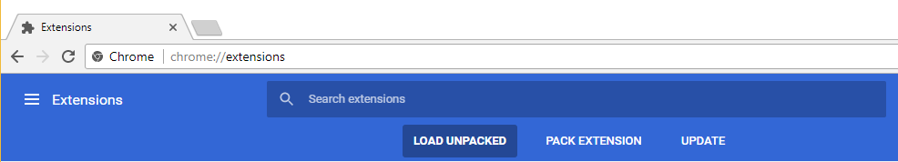

# Chromedash

Do you happen to use the popular documentation browser [Dash](https://kapeli.com/dash)? Do you also dislike setting a global hotkey for launching Dash with your query; instead preferring to set your hotkey within the current application you are using? Do you also use Chrome? 

This may be the extension for you.  

## Getting Started

Because this extension is not yet available via the Chrome Web Store, you must launch it as an unpacked extension.

### Installing

Navigate to `chrome://extensions`

Click on "Load Unpacked"

Choose the plugin folder

## Built With

[Awesomeplete](https://leaverou.github.io/awesomplete/) - Used to implement selection of language filter for dash queries

## Author

Julian Raymar - [jraymar](https://github.com/jraymar)

## License

This project is licensed under the MIT License - see the [LICENSE.md](LICENSE.md) file for details

## Acknowledgments

Many thanks to [PurpleBooth](https://github.com/PurpleBooth) for writing a very nice readme template which I've used here